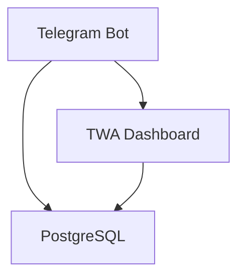
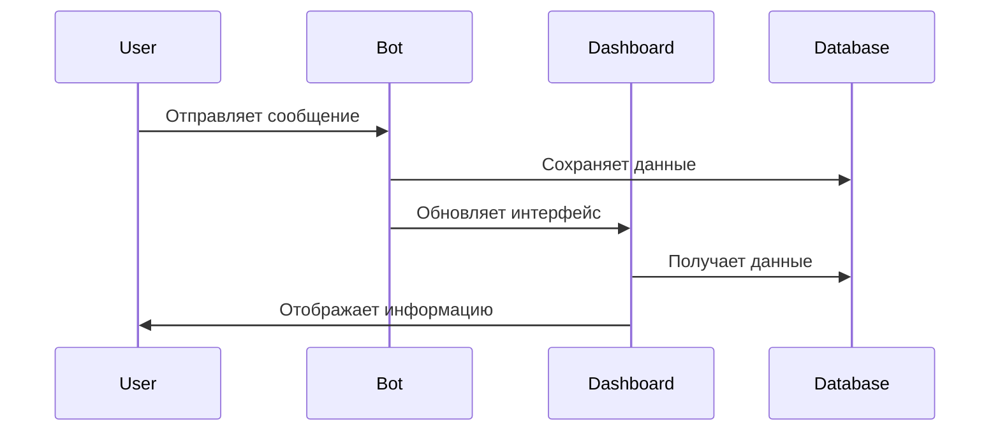

# Документация по развертыванию и поддержке

## СОДЕРЖАНИЕ
1. [Конфигурация сервисов](#конфигурация-сервисов)
2. [Переменные окружения](#переменные-окружения)
3. [Настройки Railway](#настройки-railway)
4. [Архитектура проекта](#архитектура-проекта)
5. [Процедуры развертывания](#процедуры-развертывания)
6. [Процедуры бэкапа](#процедуры-бэкапа)
7. [Масштабирование](#масштабирование)
8. [Мониторинг](#мониторинг)
9. [Восстановление](#восстановление)
10. [Диагностика](#диагностика)
11. [Эскалация](#эскалация)
12. [Прогресс разработки](#прогресс-разработки)

## КОНФИГУРАЦИЯ СЕРВИСОВ

### 1. Telegram Bot
```yaml
- План: Hobby
- Цена: $5/месяц
- Ресурсы:
  • CPU: 512 MB
  • RAM: 1 GB
  • Диск: 1 GB
- Настройки:
  • Автоматический деплой
  • Автоматическое масштабирование
  • Мониторинг метрик
```

### 2. TWA Dashboard
```yaml
- План: Hobby
- Цена: $5/месяц
- Ресурсы:
  • CPU: 512 MB
  • RAM: 1 GB
  • Диск: 1 GB
- Настройки:
  • Автоматический деплой
  • Автоматическое масштабирование
  • Мониторинг метрик
```

### 3. PostgreSQL
```yaml
- План: Hobby
- Цена: $5/месяц
- Ресурсы:
  • CPU: 512 MB
  • RAM: 1 GB
  • Диск: 1 GB
- Настройки:
  • Автоматическое резервное копирование
  • Мониторинг метрик
  • Автоматическое масштабирование
```

## ПЕРЕМЕННЫЕ ОКРУЖЕНИЯ

### 1. Telegram Bot
```env
BOT_TOKEN=your_bot_token
WEBAPP_URL=your_webapp_url
DATABASE_URL=your_database_url
```

### 2. TWA Dashboard
```env
REACT_APP_API_URL=your_api_url
REACT_APP_BOT_TOKEN=your_bot_token
```

### 3. PostgreSQL
```env
DATABASE_URL=your_database_url
```

## НАСТРОЙКИ RAILWAY

### 1. Общие настройки
```yaml
- Автоматический деплой
- Автоматическое масштабирование
- Мониторинг метрик
- Резервное копирование
```

### 2. Настройки для каждого сервиса
```yaml
- Telegram Bot:
  • Автоматический деплой
  • Автоматическое масштабирование
  • Мониторинг метрик

- TWA Dashboard:
  • Автоматический деплой
  • Автоматическое масштабирование
  • Мониторинг метрик

- PostgreSQL:
  • Автоматическое резервное копирование
  • Мониторинг метрик
  • Автоматическое масштабирование
```

## АРХИТЕКТУРА ПРОЕКТА

### 1. Компоненты


### 2. Взаимодействие


## ПРОЦЕДУРЫ РАЗВЕРТЫВАНИЯ

### 1. Развертывание Telegram Bot
```bash
# 1. Клонировать репозиторий
git clone https://github.com/marchulka/berry-twa-dashboard.git

# 2. Установить зависимости
yarn install

# 3. Создать .env файл
cp .env.example .env

# 4. Настроить переменные окружения
# 5. Запустить приложение
yarn start
```

### 2. Развертывание TWA Dashboard
```bash
# 1. Клонировать репозиторий
git clone https://github.com/marchulka/berry-twa-dashboard.git

# 2. Установить зависимости
yarn install

# 3. Создать .env файл
cp .env.example .env

# 4. Настроить переменные окружения
# 5. Запустить приложение
yarn start
```

### 3. Развертывание PostgreSQL
```bash
# 1. Создать базу данных
createdb berry_twa_dashboard

# 2. Применить миграции
yarn migrate

# 3. Заполнить начальные данные
yarn seed
```

## ПРОЦЕДУРЫ БЭКАПА

### 1. Бэкап базы данных
```bash
# 1. Создать бэкап
pg_dump -U postgres berry_twa_dashboard > backup.sql

# 2. Сохранить бэкап
# 3. Проверить целостность
```

### 2. Восстановление из бэкапа
```bash
# 1. Восстановить бэкап
psql -U postgres berry_twa_dashboard < backup.sql

# 2. Проверить целостность
# 3. Запустить приложение
```

## МАСШТАБИРОВАНИЕ

### 1. Триггеры масштабирования
```yaml
- CPU > 80%
- RAM > 80%
- Диск > 80%
- Количество запросов > 1000/мин
```

### 2. План масштабирования
```yaml
- Увеличить ресурсы
- Добавить реплики
- Настроить балансировку
```

## МОНИТОРИНГ

### 1. Метрики
```yaml
- CPU
- RAM
- Диск
- Количество запросов
- Время ответа
```

### 2. Алерты
```yaml
- CPU > 80%
- RAM > 80%
- Диск > 80%
- Время ответа > 1с
```

## ВОССТАНОВЛЕНИЕ

### 1. Быстрое восстановление
```yaml
- Восстановить бэкап
- Перезапустить сервисы
- Проверить работоспособность
```

### 2. Ручное восстановление
```yaml
- Определить причину
- Исправить проблему
- Восстановить данные
- Перезапустить сервисы
```

## ДИАГНОСТИКА

### 1. Проверка логов
```bash
# 1. Проверить логи
tail -f logs/app.log

# 2. Анализировать ошибки
# 3. Принимать меры
```

### 2. Проверка метрик
```bash
# 1. Проверить метрики
# 2. Анализировать тренды
# 3. Принимать меры
```

## ЭСКАЛАЦИЯ

### 1. Контакты
```yaml
- Разработчик: @marchulka
- DevOps: @marchulka
- Поддержка: @marchulka
```

### 2. Процесс эскалации
```yaml
- Определить уровень проблемы
- Связаться с ответственным
- Документировать решение
```

## ПРОГРЕСС РАЗРАБОТКИ

### 1. Журнал изменений
```markdown
#### [2024-03-21] - v0.1.0 - В разработке
- [x] Создание базовой документации
  - [x] Структура документации
  - [x] Процедуры развертывания
  - [x] Процедуры бэкапа
  - [x] Мониторинг и алерты
  - [x] Восстановление и диагностика

#### [2024-03-21] - v0.1.1 - В разработке
- [ ] Настройка мониторинга
  - [ ] Базовый мониторинг Railway
    • [ ] Настройка дашборда
    • [ ] Отслеживание CPU/RAM/Storage
    • [ ] Мониторинг response times
  - [ ] Мониторинг приложения
  - [ ] Мониторинг базы данных
  - [ ] Настройка алертов

#### [2024-03-21] - v0.1.0 - В разработке
- [ ] Подготовка к масштабированию
  - [ ] Контейнеризация
  - [ ] Управление конфигурацией
  - [ ] Модульная архитектура
  - [ ] Хранение данных
  - [ ] Infrastructure as Code

#### [2024-03-21] - v0.1.0 - В разработке
- [ ] Расширенная документация
  - [ ] Архитектурная документация
  - [ ] Операционная документация
  - [ ] Документация для разработки
  - [ ] Метрики и KPI
  - [ ] Runbook'и
```

### 2. Текущие изменения
```markdown
## [2024-03-21] - Настройка базового мониторинга Railway

### Описание
Настройка базового мониторинга в Railway для отслеживания основных метрик системы.

### Изменённые файлы
- [ ] DEPLOYMENT.md (добавление раздела мониторинга)
- [ ] railway.toml (настройки мониторинга)

### Проверки
- [ ] Дашборд Railway доступен
- [ ] Метрики CPU/RAM/Storage отображаются
- [ ] Response times отслеживаются
- [ ] Алерты настроены

### Примечания
- Используем встроенный мониторинг Railway
- Настраиваем базовые метрики для всех сервисов
- Готовим к расширению мониторинга
```

### 3. Контрольный лист текущего изменения
```markdown
#### Настройка базового мониторинга Railway
1. Планирование:
   - [x] Анализ текущего состояния
   - [x] Определение необходимых изменений
   - [x] Создание плана действий

2. Реализация:
   - [ ] Настройка дашборда в Railway
   - [ ] Настройка метрик CPU/RAM/Storage
   - [ ] Настройка мониторинга response times
   - [ ] Обновление документации
   - [ ] Создание коммитов

3. Проверка:
   - [ ] Тестирование отображения метрик
   - [ ] Проверка документации
   - [ ] Валидация настроек

4. Деплой:
   - [ ] Пуш в репозиторий
   - [ ] Проверка деплоя
   - [ ] Мониторинг после деплоя
```

### 4. Правила документации
```